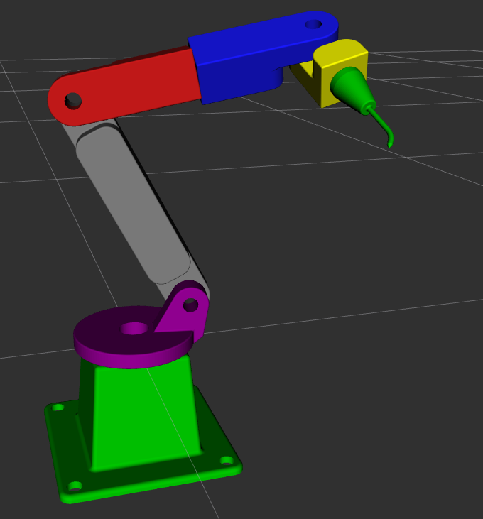

# 🤖 Brazo Robótico 6-DOF (ROS 2 Humble)


Paquete de simulación y descripción para un brazo robótico de 6 grados de libertad (6-DOF), diseñado desde cero para **ROS 2 Humble**.

El proyecto incluye la descripción URDF completa, mallas visuales y de colisión optimizadas, y los archivos fuente de diseño CAD.



## ✨ Características

* **Descripción URDF/Xacro:** Modelo cinemático completo con límites de articulación (joint limits) configurados para evitar autocolisiones.
* **Mallas Personalizadas:**
    * Visuales: Exportadas en escala precisa (mm a m).
    * Colisiones: Geometría optimizada para planificadores de movimiento.
    * Código de colores para fácil identificación de eslabones (Links).
* **Fuente CAD:** Incluye el archivo original de **FreeCAD** (`.FCStd`) en la carpeta `cad/`.
* **Automatización:** Incluye un `Makefile` para facilitar la compilación y ejecución.

## � Uso

### Compilar el proyecto

```bash
make build
```

Compila el paquete usando `colcon build --symlink-install`. Gracias al symlink, si modificas archivos Python, XML o URDF/Xacro, no necesitas recompilar.

### Lanzar la visualización

```bash
make launch
```

Ejecuta `ros2 launch my_robot_arm display.launch.py` que abre **RViz** con el modelo del robot. Incluye un panel de **Joint State Publisher GUI** para mover las articulaciones manualmente.

### Otros comandos útiles

| Comando | Descripción |
|---------|-------------|
| `make clean` | Elimina las carpetas `build/`, `install/` y `log/` |
| `make rebuild` | Ejecuta `clean` + `build` (reconstrucción completa) |
| `make deps` | Instala dependencias faltantes con `rosdep` |
| `make check` | Muestra los archivos instalados en `share/` |

> **Nota:** Si estás en Ubuntu 22.04 con ROS 2 Humble instalado nativamente, puedes usar estos comandos directamente. El comando `make start` solo es necesario si usas Distrobox.

## �📂 Estructura del Proyecto

```text
.
├── Makefile                # Atajos para compilar y lanzar
├── cad/                    # Archivos fuente de diseño (FreeCAD)
└── src/my_robot_arm/       # Paquete ROS 2
    ├── launch/             # Archivos de lanzamiento (display.launch.py)
    ├── meshes/             # Archivos STL (Visual & Collision)
    └── urdf/               # Descripción del robot (.xacro)

```

## 🔗 Créditos y Referencias 3D
La geometría de este robot está basada en un diseño open-source obtenido de GrabCAD. 
* **Modelo Original:** Simple Robotic Arm 6 Axes
* **Autor:** Kevin Putra Adiwijna
* **Fuente:** https://grabcad.com/library/simple-robotic-arm-6-axes-1